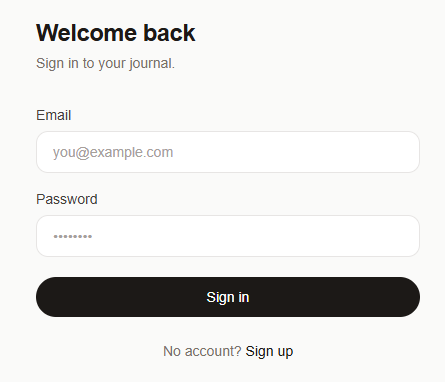
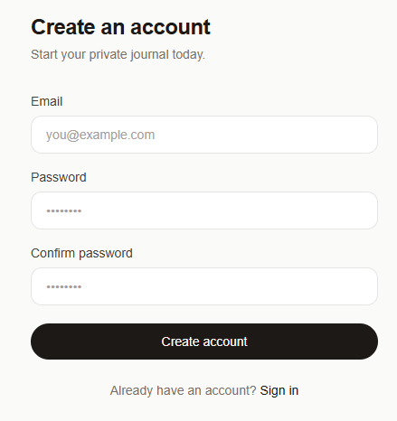
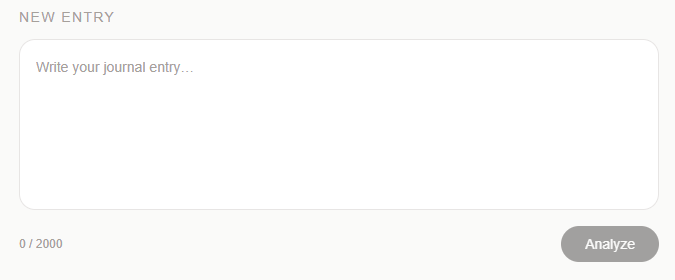
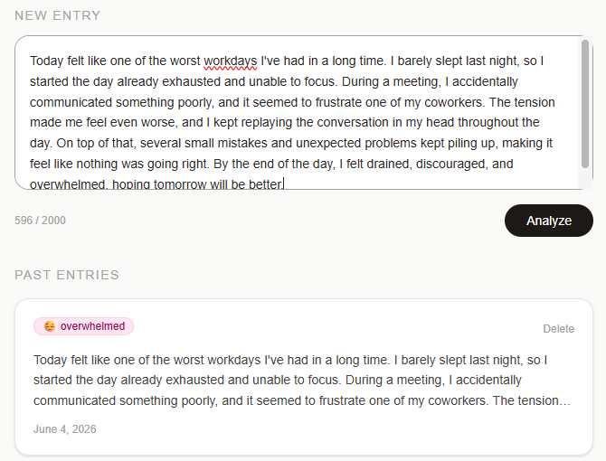
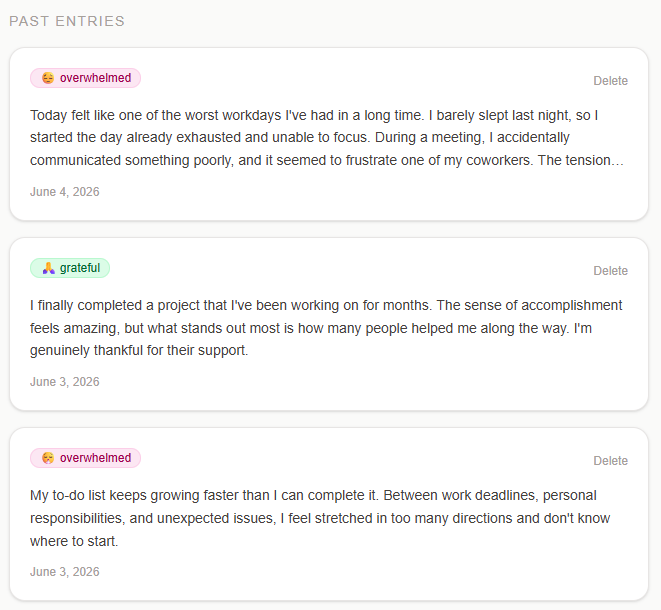
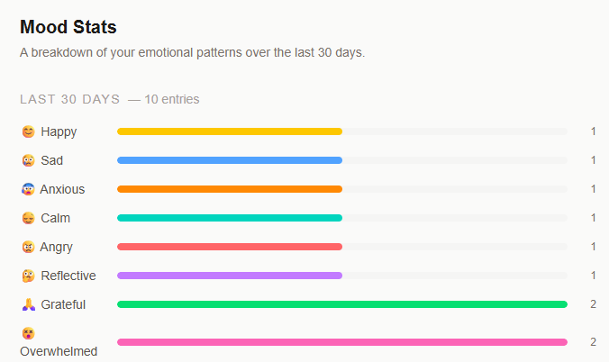

# MoodScribe

**A mood-aware journaling app.** Write an entry, let Claude analyse your emotional tone, and reflect on your patterns over time.

The core loop is simple: **Write → Analyse → Reflect.**

Built with Next.js 16 App Router, Supabase Auth + RLS, and the Anthropic Claude API. Deployed on Vercel.

---

## Demo

> Sign up → write a journal entry → click **Analyse** → see your mood label, emoji, and an affirming sentence → entries are saved automatically → view your 30-day mood breakdown on the Stats page.

---

## Features

- **Mood analysis** — Claude Sonnet 4.6 reads your entry and returns one of eight mood labels: `happy`, `sad`, `anxious`, `calm`, `angry`, `reflective`, `grateful`, `overwhelmed`
- **Private journals** — every user sees only their own entries, enforced by Supabase Row Level Security at the database layer
- **Persistent history** — entries are saved automatically after analysis; the full list is server-rendered on each visit
- **30-day mood stats** — a visual breakdown of your emotional patterns over the last month
- **Daily rate limit** — the Claude API is capped at 20 analyses per user per UTC day
- **Auth** — email + password sign-up and login via Supabase Auth
- **Responsive** — works on mobile and desktop

---

## Screenshots

### Login


### Sign Up


### Journal — Empty State


### Journal — After Analysis


### Journal — Entry History


### Mood Stats


---

## Architecture

### Principles

| Principle | Implementation |
|---|---|
| Server-first | React Server Components by default; `"use client"` only where event handlers or browser APIs are required |
| One-way data flow | Supabase → Server Component → props → Client Component |
| Server Actions for mutations | All Supabase writes go through `actions/entries.ts` |
| API Route for Claude | `app/api/analyze/route.ts` is the sole entry point to the Anthropic SDK |
| RLS as the security layer | Supabase policies enforce user isolation at the database; application filtering is a secondary defence |
| API key never reaches the browser | `ANTHROPIC_API_KEY` is read only in the API route; it has no `NEXT_PUBLIC_` prefix |

### Request flow

```
Browser
  │
  ├─ Page load ──▶ Server Component ──▶ Supabase (via server client + RLS)
  │
  └─ Analyse click ──▶ POST /api/analyze ──▶ lib/claude.ts ──▶ Anthropic API
                                          └──▶ saveEntry() Server Action ──▶ Supabase
```

### Auth flow

```
proxy.ts (Next.js middleware)
  └─ refreshes Supabase session cookie on every request

app/(app)/layout.tsx
  └─ reads session server-side
  └─ redirects to /login if no session
```

---

## Project Structure

```
moodscribe/
├── app/
│   ├── (auth)/                   # Unauthenticated routes — no app chrome
│   │   ├── login/page.tsx
│   │   └── signup/page.tsx
│   ├── (app)/                    # Authenticated routes — guarded by layout
│   │   ├── layout.tsx            # Auth guard: redirects to /login if no session
│   │   ├── journal/page.tsx      # Main journal view with Suspense skeleton
│   │   └── stats/page.tsx        # 30-day mood breakdown
│   ├── api/
│   │   └── analyze/route.ts      # POST — calls Claude, returns MoodResult JSON
│   ├── layout.tsx                # Root layout: fonts, metadata
│   └── page.tsx                  # Redirects to /journal or /login
│
├── components/
│   ├── entry-card.tsx            # Single entry: content, mood badge, date, delete
│   ├── entry-form.tsx            # Textarea + Analyse button ("use client")
│   ├── entry-list.tsx            # Async Server Component — fetches and renders entries
│   ├── entry-list-skeleton.tsx   # Suspense fallback skeleton
│   ├── mood-badge.tsx            # Emoji + label chip, colour-coded per mood
│   └── mood-stats.tsx            # 30-day mood breakdown display
│
├── lib/
│   ├── supabase/
│   │   ├── client.ts             # Browser Supabase client (auth forms only)
│   │   └── server.ts             # Server Supabase client using @supabase/ssr
│   ├── claude.ts                 # analyzeEntry() — calls Anthropic SDK
│   └── types.ts                  # Entry, Mood, MoodResult
│
├── actions/
│   └── entries.ts                # Server Actions: saveEntry, getEntries, getMoodCounts, deleteEntry
│
├── supabase/
│   └── migrations/
│       ├── 001_create_entries.sql
│       └── 002_add_user_id_and_rls.sql
│
└── proxy.ts                      # Supabase session refresh middleware
```

---

## Local Development

### Prerequisites

- Node.js 20+
- npm
- A [Supabase](https://supabase.com) project
- An [Anthropic](https://console.anthropic.com) API key

### Setup

```bash
# 1. Clone the repository
git clone https://github.com/DuongNhatThanh/moodscribe.git
cd moodscribe

# 2. Install dependencies
npm install

# 3. Copy the env template and fill in your values
cp .env.example .env.local

# 4. Run the database migrations
#    Open the Supabase dashboard → SQL Editor
#    Run supabase/migrations/001_create_entries.sql
#    Then run supabase/migrations/002_add_user_id_and_rls.sql

# 5. Start the dev server
npm run dev
```

Open [http://localhost:3000](http://localhost:3000).

### Build

```bash
npm run build   # TypeScript compile + Next.js production build
npm start       # Serve the production build locally
```

---

## Environment Variables

Copy `.env.example` to `.env.local` and fill in your values:

| Variable | Description | Public? |
|---|---|---|
| `NEXT_PUBLIC_SUPABASE_URL` | Your Supabase project URL | Yes — safe to expose |
| `NEXT_PUBLIC_SUPABASE_ANON_KEY` | Supabase anon key — RLS enforces data access | Yes — safe to expose |
| `ANTHROPIC_API_KEY` | Anthropic API key for Claude | **No — server-side only** |

> **Important:** `ANTHROPIC_API_KEY` must never be prefixed with `NEXT_PUBLIC_`. Doing so would expose the key to every browser that loads the app and allow anyone to call the Claude API on your behalf.

---

## Database & RLS

MoodScribe uses a single table, `public.entries`, introduced across two migrations that mirror the natural progression of a growing product.

**`001_create_entries.sql`** — creates the table with `user_id` nullable (auth does not exist yet at this stage).

**`002_add_user_id_and_rls.sql`** — tightens the schema for production:

```sql
-- user_id becomes NOT NULL with a foreign key to auth.users
ALTER TABLE public.entries
  ALTER COLUMN user_id SET NOT NULL;

ALTER TABLE public.entries
  ADD CONSTRAINT entries_user_id_fkey
  FOREIGN KEY (user_id) REFERENCES auth.users(id) ON DELETE CASCADE;

-- RLS enabled; three policies enforce per-user isolation
ALTER TABLE public.entries ENABLE ROW LEVEL SECURITY;

CREATE POLICY "users_select_own_entries"
  ON public.entries FOR SELECT
  USING (auth.uid() = user_id);

CREATE POLICY "users_insert_own_entries"
  ON public.entries FOR INSERT
  WITH CHECK (auth.uid() = user_id);

CREATE POLICY "users_delete_own_entries"
  ON public.entries FOR DELETE
  USING (auth.uid() = user_id);
```

RLS means that even if application-level filtering were bypassed, the database would still return only the authenticated user's rows.

---

## Security

| Concern | Mitigation |
|---|---|
| API key exposure | `ANTHROPIC_API_KEY` is read exclusively in `app/api/analyze/route.ts` — a server-only file. It has no `NEXT_PUBLIC_` prefix and never appears in any client bundle |
| Cross-user data access | Supabase RLS policies enforce `auth.uid() = user_id` on every SELECT, INSERT, and DELETE |
| Service role key | The Supabase service role key is not used anywhere in this codebase. All data access uses the anon key scoped by RLS |
| Input validation | Entries are validated (minimum 10 chars, maximum 2 000 chars, non-empty after trim) in the API route before Claude is called |
| Daily rate limit | The API route checks how many entries the authenticated user has created today; if the count reaches 20, it returns 429 and does not call Claude |
| Auth guard | `app/(app)/layout.tsx` performs a server-side session check on every request to authenticated routes and redirects to `/login` if no session is found |
| Session refresh | `proxy.ts` refreshes the Supabase session cookie on every request using `getUser()`, which performs server-side JWT verification rather than trusting the local cookie value |

---

## Deployment

The app is deployed on [Vercel](https://vercel.com) with automatic deploys on every push to `main`.

### Steps to deploy your own instance

1. Push the repository to GitHub.
2. Import the project into Vercel.
3. Add the three environment variables in the Vercel dashboard under **Settings → Environment Variables**:
   - `NEXT_PUBLIC_SUPABASE_URL`
   - `NEXT_PUBLIC_SUPABASE_ANON_KEY`
   - `ANTHROPIC_API_KEY`
4. Trigger a redeploy.

No additional Vercel configuration is required — `next.config.ts` uses framework defaults.

---

## Lessons Learned

**1. Server Components change where you think about data.**
The App Router pushes you to fetch data at the top of the tree and pass it down as props. Once that pattern clicks, the boundary between server and client becomes a deliberate architectural decision rather than an afterthought.

**2. RLS is not optional — it is the contract.**
Relying on application-level `WHERE user_id = ?` filtering alone is fragile. Having the database enforce the same rule means a bug in application code cannot leak another user's data.

**3. Two-migration schema design reflects how production schemas actually evolve.**
Starting with `user_id` nullable (no auth yet) and tightening it once real users existed mirrored the natural progression of a growing product — not a shortcut but a deliberate sequencing decision.

**4. API key placement matters from day one.**
Deciding at the start that `ANTHROPIC_API_KEY` lives only in one server-side file makes it impossible to accidentally expose it in a client bundle. The constraint is architectural, not discipline-dependent.

**5. A well-specified fallback is a forcing function for a good prompt.**
The Claude integration returns a safe fallback `MoodResult` on any failure. Knowing the fallback exists made writing a tight, well-specified system prompt more important — the fallback is a safety net, not a substitute for a good prompt.

---

*Built with [Claude Code](https://claude.ai/claude-code)*
